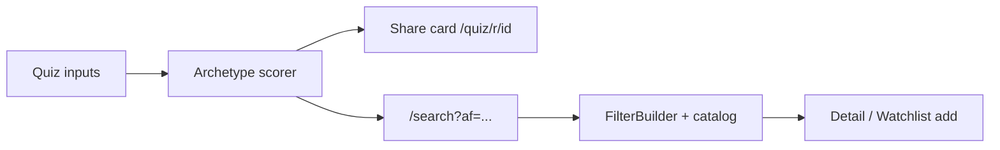

# Character identity quiz — product brief

**Status:** Deferred (see [Evaluation](#evaluation))  
**Source:** [saas-ideas consolidation](https://github.com/sarthakagrawal927/saas-ideas) @ `aba1a83`, routed via SaaS Maker Symphony task `a880f2b4-bcdb-4c2c-afc3-b310d44b6cd9`  
**Product:** Shelf / MAL Explorer (`anime_list`)  
**Date:** 2026-06-04

## Problem statement

Cold visitors and light watchlist users struggle to turn “what am I into?” into a concrete next search on a 14k+ title catalog. The saas-ideas cluster proposed mapping **bio/tweet text** or taste signals to an **anime character archetype** with shareable identity badges and show recommendations.

This brief evaluates that loop for MAL Explorer and defines a **privacy-safe v1** that reuses existing discovery primitives—not a net-new social graph or character database.

## Goals (if built later)

| Goal | Metric (hypothesis) |
|------|---------------------|
| Discovery | ≥30% of quiz completers open the linked search URL within the session |
| Retention | ≥10% of signed-in completers add ≥1 title to watchlist within 7 days |
| Share | ≥5% of completers copy or share the result link (track via `quiz_share` event) |

## Non-goals (v1)

- Scraping Twitter/X, Instagram, or any private social profile
- Social OAuth (X, Meta, etc.)—Google sign-in remains optional for watchlist only
- Storing or sending user free-text to third-party analytics
- “Which exact MAL character are you?” (no character entity graph in Turso today)
- Manga quiz, cross-media (novel/game) recommendations, or paid AI tiers

## Evaluation

### Fit with current product

MAL Explorer already ships discovery and retention loops:

- **Shareable search:** filter state in URL (`/search` with `af`, `q`, genres, etc.) via `FilterBuilder` + nuqs
- **Watchlist taste:** `buildTasteRecommendations()` → `/api/watchlist/recommendations` on the watchlist page
- **Seasonal discover:** `/discover` queue scores current/previous season titles against watchlist genre/theme weights

A character **archetype** quiz is metaphorical branding on top of the same taste vectors—not a new recommendation engine.

### Does it strengthen discovery or retention?

| Signal | Assessment |
|--------|------------|
| Cold-start discovery | **Moderate.** Multiple-choice “vibe” picks or a pasted bio can bootstrap a filter URL without sign-in; value is similar to genre quick-picks already on search. |
| Signed-in retention | **Low incremental.** Watchlist-based recommendations and discover queue already encode stronger signals than a one-off quiz. |
| Viral share | **Uncertain.** Identity cards can drive top-of-funnel visits, but utility-first anime tools rarely sustain quiz virality without marketing; unproven for this product. |
| Bio/tweet parsing | **Weak / risky.** Adds LLM cost, unclear lift over 5–7 structured questions, and privacy review surface for little gain vs watchlist. |

### Decision: **Deferred**

Ship only if analytics show a **cold-start drop-off** problem (e.g. high bounce on `/search` with zero filters and no sign-in) or explicit user demand. Until then, invest in discover queue visibility and watchlist import—not quiz infrastructure.

**Smallest proof before build:** static landing + 7-question client-only prototype linked to pre-built `/search` URLs; no backend, no OG images. If click-through to search is weak, do not implement share cards or API.

---

## V1 concept: “Shelf archetype” (not licensed characters)

Twelve fixed **archetypes** (original names + copy), each defined by:

- `id` — slug, e.g. `steady-strategist`
- `title` — display name
- `tagline` — one line for share card
- `traits` — 3 bullet traits (UX only)
- `filterBundle` — genres/themes/types aligned to `SearchFilter[]` + default sort
- `exemplarMalIds` — 3 catalog `mal_id`s for thumbnails (public metadata only)

Example archetypes (illustrative set):

| id | title | Taste bias (maps to filters) |
|----|-------|------------------------------|
| `steady-strategist` | Steady Strategist | Seinen, Drama, Psychological |
| `chaotic-optimist` | Chaotic Optimist | Comedy, Action, Shounen |
| `quiet-observer` | Quiet Observer | Slice of Life, Iyashikei, Slow pace |
| `romantic-dreamer` | Romantic Dreamer | Romance, Shoujo, Drama |
| `edge-seeker` | Edge Seeker | Horror, Thriller, Suspense |
| `world-builder` | World Builder | Fantasy, Adventure, long-run types |
| `sports-drive` | Sports Drive | Sports, competitive themes |
| `mecha-pilot` | Mecha Pilot | Sci-Fi, Mecha, Action |
| `idol-energy` | Idol Energy | Music, Performance, Comedy |
| `cozy-curator` | Cozy Curator | Slice of Life, Comedy, low stakes |
| `mystery-hunter` | Mystery Hunter | Mystery, Detective, Thriller |
| `art-house` | Art House | Avant Garde, Award-bias score floor |

Scoring: weighted distance from user **signal vector** to each archetype centroid (genres/themes/types). No LLM required for default path.

---

## Input modes (privacy-safe, priority order)

### 1. Watchlist signals (preferred, signed-in)

- Read existing watchlist via `/api/watchlist` (already authenticated).
- Reuse `buildTasteRecommendations` weighting (`POSITIVE_STATUS_WEIGHTS` / `NEGATIVE_STATUS_WEIGHTS` in `src/recommendations.ts`).
- Map top genre/theme signals → nearest archetype.
- **Storage:** optional ephemeral `quiz_result` row (user_id, archetype_id, created_at) for “retake” analytics—no bio text.

### 2. Structured vibe quiz (default for signed-out)

- 7 single-select questions (energy, stakes, romance, violence tolerance, episode length, era, tone).
- Each answer increments archetype scores client-side.
- **No server persistence** until user signs in and opts to save result.

### 3. Optional self-description (opt-in text)

- Textarea: 280–500 chars, user-authored (not imported from social).
- Process **in Worker** with rules-first keyword map; optional `free-ai` call with:
  - No logging of raw text
  - Request discarded after response
  - Explicit consent copy: “Processed once to suggest an archetype; not stored.”
- **Not required** for v1 launch; can ship structured quiz only.

### Explicitly excluded

- OAuth to social networks
- URL paste of profile/timeline scraping
- Server-side fetch of tweet bios
- Training or fine-tuning on user text

---

## Share card (one artifact)

**Purpose:** Single shareable object for social posts—not a feed of badges.

| Field | Spec |
|-------|------|
| Public URL | `https://anime-list-9lk.pages.dev/quiz/r/{archetypeId}` — no user id, no watchlist leak |
| OG image | 1200×630 static or SSR: archetype title, tagline, 3 exemplar posters (MAL CDN), Shelf logo |
| Page body | Archetype description + primary CTA button |
| Copy action | “Copy link” + optional pre-written post text with URL |
| Privacy | Result URL encodes only `archetypeId`; signed-in users do not get personalized URLs |

**Analytics (PostHog):** `quiz_complete`, `quiz_share_copy`, `quiz_cta_search_click`.

---

## Recommendation path (one path back into product)

**Primary CTA — “Explore shows for this archetype”**

Deep link into existing anime search with pre-filled filters derived from `filterBundle`:

```
/search?af=<json-encoded SearchFilter[]>&sort=score&members=<DEFAULT_ANIME_MIN_MEMBERS>
```

Implementation notes:

- Reuse `DEFAULT_ANIME_MIN_MEMBERS` (100k) from `lib/animeSearchDefaults.ts` for catalog quality parity.
- If signed in, append watchlist hide flags the same way `FilterBuilder` does (`hideWatched` / `watchlistMode`) so results exclude completed/avoiding titles.
- Show 3 `exemplarMalIds` as cards linking to `/anime/[malId]` detail routes.

**Secondary (signed-in only, not v1 CTA):** subtle link “See more from your watchlist” → `/watchlist` recommendations block (existing UI).

Do **not** fork a separate recommendation API for v1; archetype → search URL is the single funnel.



---

## Technical sketch (deferred implementation)

| Layer | Work |
|-------|------|
| Frontend | `app/quiz/page.tsx`, `app/quiz/r/[id]/page.tsx`, client scorer, CTA to search |
| Worker | Optional `POST /api/quiz/score` (watchlist-only JSON body, no text) |
| Data | Static `archetypes.json` in repo; no Turso migration required for v0 |
| Assets | OG template or `@vercel/og` on Pages |
| Tests | Unit tests for scorer mapping; e2e smoke: quiz → search URL renders results |

**Effort estimate:** ~2–3 days for structured quiz + share page + search deep links; +1–2 days for watchlist scoring and OG images.

---

## Risks and mitigations

| Risk | Mitigation |
|------|------------|
| Quiz feels gimmicky vs serious filters | Frame as “taste shortcut,” keep archetypes generic, CTA lands on real search |
| LLM bio path privacy backlash | Defer bio path; ship structured quiz only |
| MAL image 403 on OG | Use exemplar ids known to work with CDN proxy pattern used elsewhere |
| Duplicates discover queue | Position quiz for **unsigned** cold start; signed-in users see watchlist path |

---

## Acceptance mapping (Symphony task)

| Criterion | Met in this doc |
|-----------|-----------------|
| Privacy-safe quiz brief | § Input modes, § Non-goals |
| No social scrape/OAuth v1 | § Non-goals, § Explicitly excluded |
| One share card | § Share card |
| One recommendation path | § Recommendation path → `/search?af=...` |
| Deferred if weak for discovery/retention | § Evaluation — **Deferred** |

## References

- Taste engine: `src/recommendations.ts`
- Discover queue: `src/worker.ts` (`/api/discover/queue`)
- Search URL state: `components/FilterBuilder.tsx` (`af`, `q`, genres)
- Ideas triage: `saas-maker/docs/ideas/saas-ideas-consolidation-2026-06-03.md`
