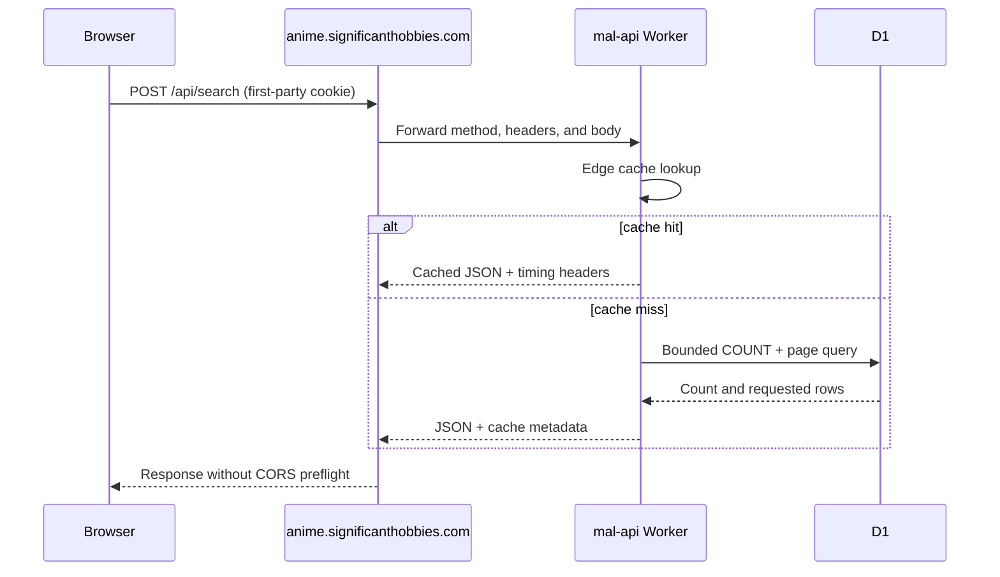

# Design

## Product surface

Alerts and Collections are removed at the routing and API boundaries while their persistence modules and tables remain intact. Discover owns two panels: the weekly queue and the taste quiz. Catalog updates becomes the catalog-history navigation destination. Historical documents may retain old names when changing them would falsify the record.

## First-party API transport

Deployed browser builds use an empty API origin, producing same-origin `/api/*` URLs. A Pages catch-all function forwards those requests to the existing Worker and returns its status, headers, body, and `Set-Cookie` response. Local development continues to use `http://localhost:8787`, and an explicit `VITE_API_URL` still overrides defaults.

The proxy refuses redirects and only forwards `/api/*`; its upstream is a fixed public Worker origin rather than user input.

## Search execution

TanStack Query remains the component-level request owner. Its stable serialized request key deduplicates identical concurrent requests, and preloaded data is treated as fresh instead of being immediately fetched a second time. Superseded query keys are aborted and cannot replace the newest result.

The Worker translates safe filter actions into parameterized D1 predicates. JSON array fields use `json_each`, title matching uses escaped `LIKE`, and airing maps to `status`. Unsupported weighted filters fall back to the existing in-memory engine. Results remain ordered by an allowlisted column and use bounded `LIMIT`/`OFFSET`.

## Catalog update integrity

Anime and manga update entrypoints distinguish a legitimate no-change update from an upstream failure. A required fetch that yields zero usable rows raises an error before any success summary is emitted, causing GitHub Actions to fail visibly.

## Verification

- Unit tests cover deployed/local API URL selection, proxy forwarding, request deduplication, SQL filter translation, and zero-row sync failure.
- Existing Vitest, typecheck, build, docs, and diff checks remain green.
- A local production build is profiled in Chrome with network requests inspected for one search call, no preflight, stable loading UI, and cache/timing headers.
